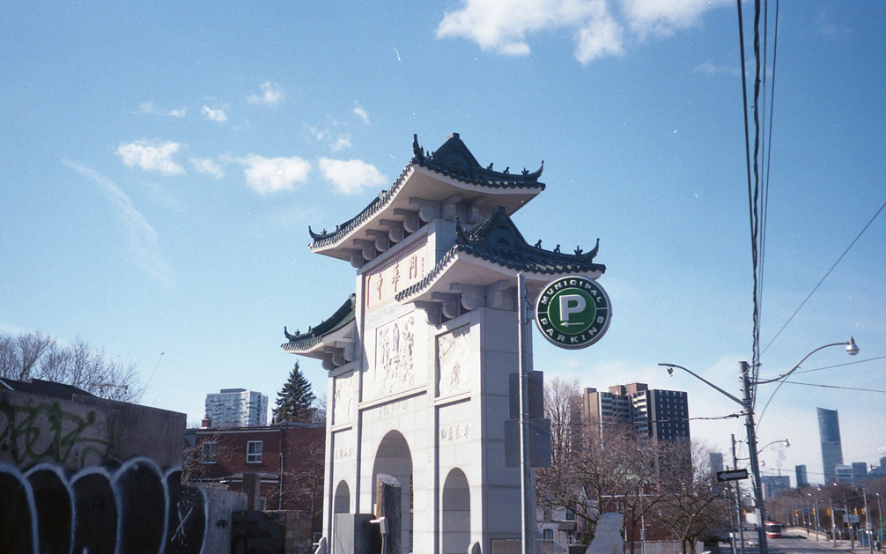
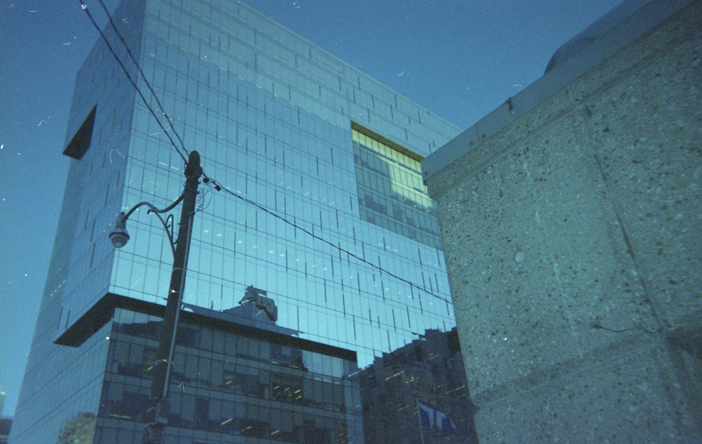
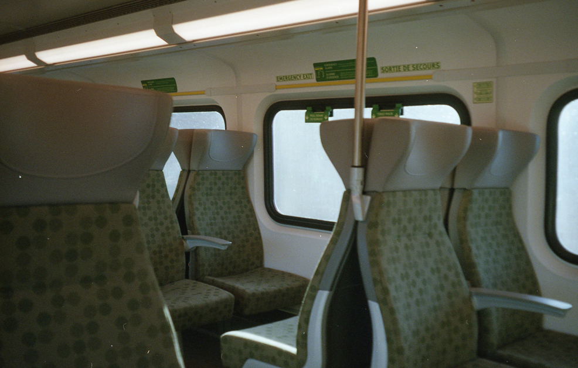
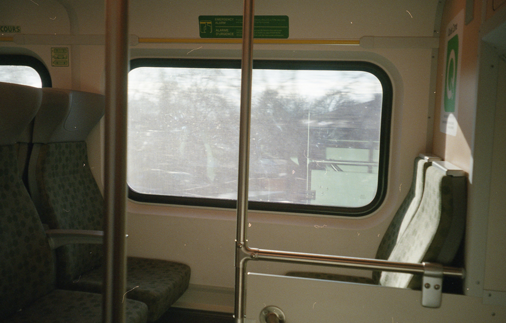

---
# Feel free to add content and custom Front Matter to this file.
# To modify the layout, see https://jekyllrb.com/docs/themes/#overriding-theme-defaults

layout: default
---

_always looking to the next day_

    
    
    
    
    
    
    
    
    
    
  

